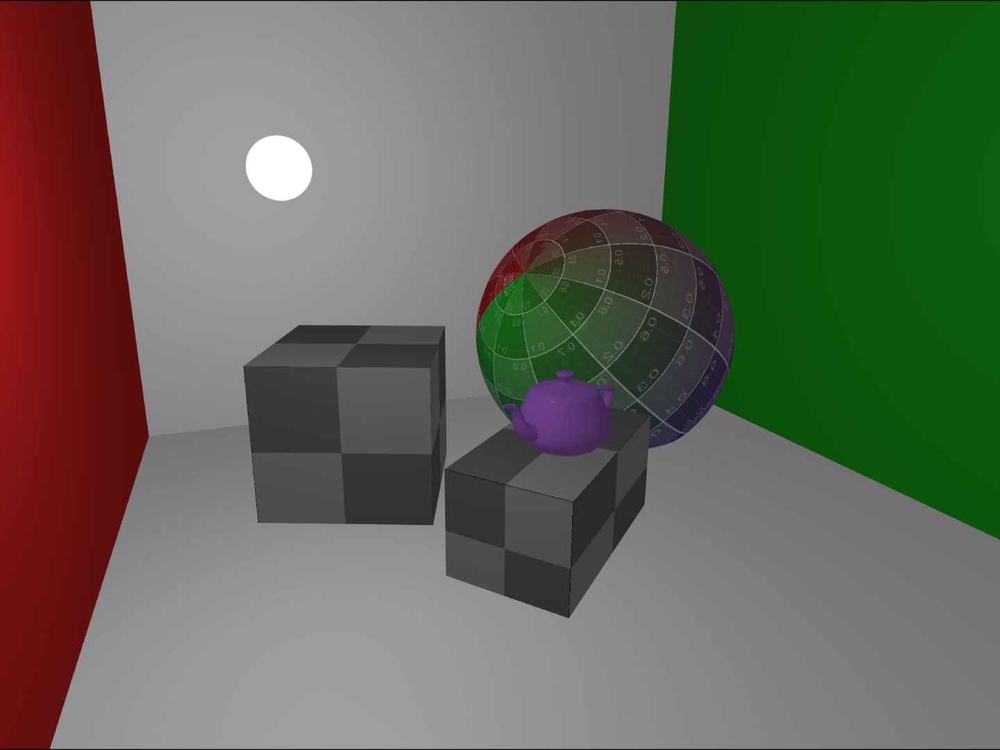

# SAGE: A Hardware Accelerated Toy Renderer



> [!WARNING]
> This project has been abandoned and will not receive any more developments. We've decided to fully
> switch over to C++, rewriting Sage from scratch, and finally completing the project. The new one
> can be found [here](https://github.com/topologicalgroup/sagecpp.git).

Sage was our first attempt at graphics programming and learning Computer Graphics. This project
is both a showcase of our learning attempt, as well as documentation for how a renderer is made.
We decided to make it in C to give ourselves a bit more challenge. Sage features very elementary
lighting, making use of the Phong reflectance model, and settting up scenes are done manually.
It's a simple hardware accelerated real-time 3D renderer using OpenGL 4.6. However, it's incomplete
and missing many fundamental lighting techniques such as shadows.

## Demoing SAGE

> [!IMPORTANT]  
> Sage was written in Linux. It's only compatible in Linux (and possibly MacOS if you were to disable nuklear).
> One of our mistakes was not setting it up so that it's cross platform. It CANNOT run on windows.

First clone our project including all of the dependency submodules.

```git
git clone --recursive https://github.com/iya5/SAGE.git
```

Ensure you have the following dependencies installed
- cmake
- make
- gcc

Finally, run
```bash
make all
make run
```
